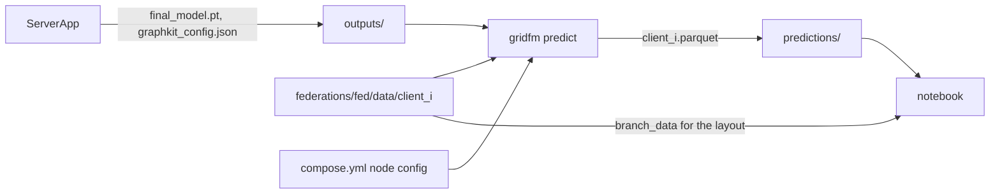

# Design

## Context

See `proposal.md` for the motivation and `docs/architecture.md` for the three stages of
a run. Facts that shape this design:

- The ServerApp of `fedavg` saves `final_model.pt` (a state dict), `metrics.json` and
  `run_config.json` to `outputs/<federation>/fedavg/<timestamp>/`. The model's
  architecture is not saved. It lives in
  `flower_app/experiments/fedavg/graphkit_config.py`.
- The containers run as `root`, so the run folders and each client's `processed/` folder
  belong to uid 0. The host user can read but not write them.
- Each client fits its own `HeteroDataMVANormalizer` during `setup("fit")`, from the
  95th percentile of its training scenarios' loads. The fitted values are not saved. The
  split and the fit are deterministic given the graphkit config, the client's networks
  and scenario counts, and the data.
- Graphkit's `PowerFlowTask.predict_step` already returns one record per bus with the
  scenario, bus, bus type, Pd, Qd and the true and predicted Vm, Va, Pg and Qg in
  physical units. The data module's `predict_dataloader` covers only the test split.
- graphkit imports `torch_scatter`, which the Dockerfiles compile from source and which
  the host lacks. The host has torch `2.14.1+cu130`.
- `gridfm_cli` never imports `flower_app`.
- `docs/adr/` holds no records yet, so no decision below follows or contradicts one.

## Goals / Non-Goals

**Goals:**

- The containers stay responsible for training only. Everything after training runs on
  the host.
- A run folder alone is enough to rebuild its model.
- Prediction reuses graphkit's data module, normalizer and `predict_step` rather than
  repeating their logic.
- The notebook reads files and plots. It has no knowledge of the task's masking rules or
  of graphkit.

**Non-Goals:**

- Running prediction on a GPU. The command runs on the CPU, like the clients.
- Saving the fitted normalizers from the clients. Refitting on the host gives the same
  values for the data the host holds.
- Tests for the new code, beyond the one-off checks in `tasks.md`.

## Decisions

### D1: Inference runs on the host, with `torch-scatter` as a project dependency

`gridfm predict` runs in the project's own environment, which gains `torch-scatter`. uv
builds it from source against the installed torch, using `no-build-isolation-package`
and `extra-build-dependencies` with `match-runtime = true`. The build is forced to CPU
only (`FORCE_CUDA=0`) so that it does not need `nvcc` even though the host torch has
CUDA.

Alternatives:

- Predicting in a one-off container from the client image. Rejected: Flower ships the
  code as a bundle at run time, so the image has no project code. The prediction code
  would have to be mounted or baked in, which gives the training image a second purpose.
- Replacing `torch_scatter` with `torch_geometric.utils.scatter` in the graphkit fork.
  This would remove the dependency everywhere, but it means maintaining a patch in
  another repository. Rejected for now.

This decision outlives the change and needs its own record. It also changes the rule in
`AGENTS.md` that code needing `torch_scatter` runs only in the images.

### D2: Runs that save a model also save their graphkit config as JSON

`save_outputs` in `flower_app/experiments/fedavg/server.py` writes
`graphkit_config.json`: `GRAPHKIT_CONFIG` as it was during the run. The client-specific
`data.networks` and `data.scenarios` are left out, as in `GRAPHKIT_CONFIG` itself. The
run folder is then self-describing, and host tools need neither `flower_app` nor the
current version of the experiment's code.

Alternatives:

- Rebuilding from the current `graphkit_config.py`. Rejected: it couples old runs to
  current code and breaks `gridfm_cli`'s rule of never importing `flower_app`.
- Pickling the whole Lightning module. Rejected: pickles depend on the classes' import
  paths and break when graphkit changes.

This decision outlives the change and needs its own record: every future experiment that
saves a model must also save the configuration to rebuild it.

### D3: Prediction rebuilds each client's data module from its node config

For each client, `gridfm predict` does the following:

1. Reads the client's node config from the federation's `compose.yml` and parses it with
   Flower's `flwr.common.config.parse_config_args`, to get `client-id`, `networks` and
   `scenarios`.
2. Builds the graphkit config from `graphkit_config.json` plus those networks and
   scenarios, as `flower_app/experiments/fedavg/task.py` does.
3. Creates `LitGridHeteroDataModule` on `federations/<federation>/data/client_<id>/` and
   calls `setup("fit")`. This splits the scenarios and fits the normalizer exactly as
   the client did, because the config, seed and data are the same.
4. Builds the task with `get_task` and the module's normalizers, and loads
   `final_model.pt`.
5. Calls `predict_step` without gradients on the CPU, for each batch of the module's
   train, validation and test datasets, passing the network's index as `dataloader_idx`
   so that it picks that network's normalizer. A Lightning `Trainer` would number its
   dataloaders itself and pick the wrong normalizer for a client with several networks.
   Each row is tagged with the split its scenario came from. Va is converted from
   graphkit's radians to the degrees of the datakit data.

The node config, not the number of scenarios on disk, decides how many scenarios the
client used. This matters because the normalizer is fitted on the training split, which
depends on that number. Parsing the node string duplicates a few lines of
`flower_app/node_config.py`, which `gridfm_cli` must not import.

Alternatives: reading `n_scenarios.txt` from each client's data. Rejected because it
gives a different split and normalizer whenever the node config uses fewer scenarios
than were generated.

### D4: Hidden flags come from the batch's masks

`predict_step` does not return which values were masked. The prediction code wraps it
and adds `Vm_given`, `Va_given`, `Pg_given` and `Qg_given` from the batch's bus mask and
generator mask (aggregated onto buses, as graphkit does for Pg). The notebook then reads
the flags instead of repeating `AddPFHeteroMask`'s rules, which stay correct if the task
changes.

### D5: Predictions live in a separate, host-owned tree

Predictions go to `predictions/<federation>/<experiment>/<run>/client_<id>.parquet`. The
tree mirrors `outputs/` and is gitignored. Files are replaced on each run of the
command. The columns are the per-bus fields of `predict_step` that the notebook needs
(scenario, bus, PQ, PV, REF, Pd, Qd, and `<feature>_target` and `<feature>_pred` for Vm,
Va, Pg and Qg), plus the four `<feature>_given` flags and `split`. The residual columns
are dropped.

Alternatives: a `predictions/` folder inside the run folder. Rejected because run
folders belong to `root`. Running the ServerApp as the host user would fix that, but it
changes the federation setup and leaves existing runs unwritable.

This decision outlives the change and needs its own record: `outputs/` is written only
by the federation, and host-made results go elsewhere.

### D6: Where the code lives

| Module                   | Contents                                                                                                                 |
| ------------------------ | ------------------------------------------------------------------------------------------------------------------------ |
| `gridfm_cli/runs.py`     | Lists the run folders of a federation and checks that a run has `final_model.pt` and `graphkit_config.json`              |
| `gridfm_cli/clients.py`  | Reads the client datasets from the node configs in `compose.yml`, without importing graphkit, so the notebook can use it |
| `gridfm_cli/predict.py`  | D3 to D5: rebuilds the model and data, predicts and writes Parquet                                                       |
| `gridfm_cli/main.py`     | The `predict` command, prompting through `choices.py` like the other commands                                            |
| `notebooks/scenarios.py` | The marimo notebook                                                                                                      |

`gridfm_cli` already imports gridfm-datakit. It now also imports gridfm-graphkit, but
still not `flower_app`.

### D7: The notebook draws with NetworkX positions and Plotly

The notebook builds one NetworkX graph per client network from the union of the branches
in all its scenarios, and lays it out once with `kamada_kawai_layout`. Because it is
deterministic and uses every branch, the positions stay fixed when the scenario changes
and the layout works for any network. Plotly draws the four panels, which gives hover
values. The panels fill a 2 x 2 grid with truth and prediction side by side on the top
row and input and error below. Each panel's y-axis is anchored to its own x-axis, so the
network keeps its proportions in every panel. Plotly is already installed with
gridfm-datakit. It becomes a direct dependency along with `networkx`, since the notebook
imports both. Bus type is shown by marker symbol, branches out of service are dashed,
and hidden inputs are grey. The explanation is a `mo.md` cell at the top. The split
label reads `scenario_picker.value` in Python code rather than in a pandas `query`
string, because marimo only reruns a cell for references it finds in code.

marimo is a `dev` dependency, because the notebook is a development tool and not part of
the `gridfm` command. The flow:

`gridfm predict` reads the run folder, the client data and the node configs, and writes
one file per client to `predictions/`. The notebook reads those files and the client
data.

## Risks / Trade-offs

- [`torch-scatter` may fail to build on a contributor's machine, for example without a
  C++ compiler or after a torch upgrade] -> The first task builds it on the host before
  anything else depends on it. `README.md` lists the compiler as a prerequisite.
- [`uv sync` gets slower because `torch-scatter` compiles] -> uv caches the built wheel,
  so only the first sync and torch upgrades pay the cost.
- [graphkit may want to rewrite a client's `processed/` folder, which belongs to `root`,
  for example after the data is regenerated] -> The command catches the permission error
  and says to run training once first or to fix the folder's owner. Data regenerated by
  `gridfm data` on the host is host-owned and is processed without problems.
- [The host normalizer could differ from the client's if the graphkit commit differs
  between the host and the images] -> Both install the same pinned commit from
  `pyproject.toml`.
- [Runs made before this change have no `graphkit_config.json`] -> They are refused with
  a message to run them again. They hold only a few rounds of a demo model.

## Migration Plan

1. Run `uv sync` to build `torch-scatter`.
2. No image rebuild is needed: the ServerApp's code ships in the FAB with each run, so
   every run made after the change exports `graphkit_config.json`.
3. Run `gridfm run fedavg`, then `gridfm predict`, then open the notebook.

Rollback: remove the `predict` command, the notebook and the dependencies. Run folders
with an extra `graphkit_config.json` stay valid.
